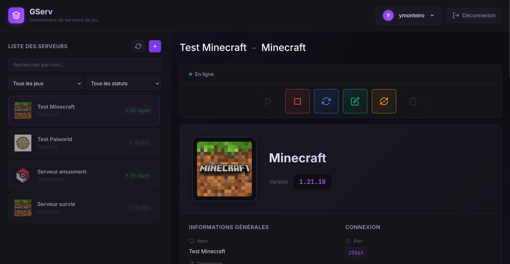

# Gserv


Gserv is a Django-based platform for managing game server instances using Docker containers. The system provides a REST API for creating, configuring, and managing game servers with support for multiple games, versions, and user roles.




## Overview

Gserv allows users to deploy and manage game servers through a web interface. Each server runs in an isolated Docker container with configurable resources, ports, and environment variables. The platform handles server lifecycle operations including creation, startup, shutdown, updates, and monitoring.

## Features

- Multi-game support with version management
- Docker-based server deployment
- User authentication and authorization with JWT
- Role-based access control for server management
- Health check monitoring for server instances
- Resource limits and port mapping configuration
- Server metrics collection (CPU, memory, players)
- Asynchronous task processing with Celery
- RESTful API with Django REST Framework

## Technology Stack

- Django 6.0
- Django REST Framework
- PostgreSQL (production) / SQLite (development)
- Docker SDK for Python
- Celery with Redis
- JWT authentication
- Channels for WebSocket support

## Project Structure

```
Gserv/
├── accounts/          # User authentication and profiles
├── games/             # Game definitions and versions
├── servers/           # Server instances and management
├── docker_manager/    # Docker container management
├── api/               # API routing and configuration
├── config/            # Django settings and configuration
└── requirements/      # Python dependencies
```

## Prerequisites

- Python 3.12+
- Docker and Docker SDK
- Redis (for Celery)
- PostgreSQL (for production)

## Installation

### Development Setup

1. Clone the repository:
```bash
git clone <repository-url>
cd Gserv
```

2. Create and activate a virtual environment:
```bash
python3 -m venv env
source env/bin/activate 
```

3. Install dependencies:
```bash
pip install -r requirements/dev.lock
```

4. Create a `.env` file in the project root with required variables, use .env.example to help.


5. Run migrations:
```bash
python manage.py migrate
```

6. Create a superuser:
```bash
python manage.py createsuperuser
```

7. Prepare log folders
Gserv/
├── logs/          
    ├── json/
    └── raw/
    

8. Start the development server:
```bash
python manage.py runserver
```

9. In a separate terminal, start Celery worker:
```bash
celery -A config worker -l info
```

10. Start Celery beat (for scheduled tasks):
```bash
celery -A config beat -l info
```

## Configuration

### Docker Configuration

The system requires access to a Docker daemon. Ensure Docker is running and accessible. The default connection uses the Unix socket at `/var/run/docker.sock`. For remote Docker hosts, configure `DOCKER_HOST` accordingly.

## API Documentation

The API documentation is automatically generated using drf-yasg.

## Background Tasks

The system uses Celery for asynchronous operations:

- Server creation and deletion
- Server start/stop operations
- Status synchronization with Docker
- Health check monitoring
- Metrics collection

Scheduled tasks run via Celery Beat:
- Container status synchronization
- Server health checks

## Monitoring

Server metrics are collected periodically and available via the API:

- CPU usage percentage
- Memory usage (MB and percentage)
- Players online
- TPS (Ticks Per Second) for supported games
- Uptime in seconds


## Logging

Server logs can be monitored through Grafana + Loki using docker-compose.yml configuration file.
Promtail is used to fetch logs and send them to Loki.